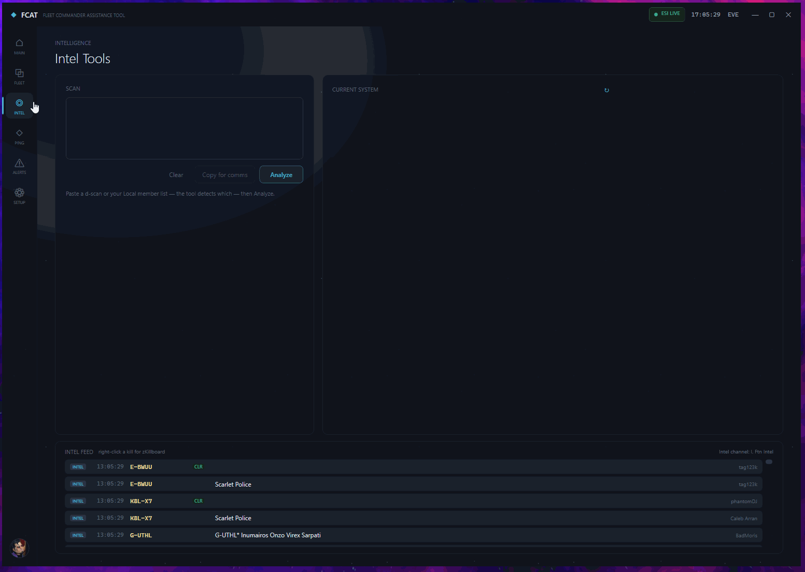
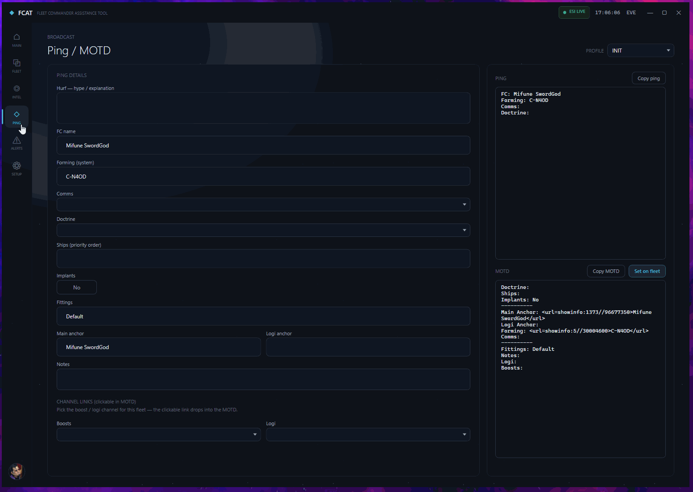
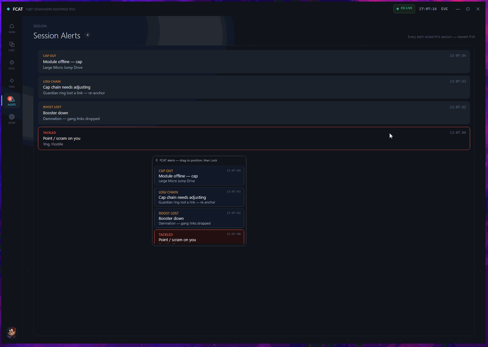

<div align="center">

# FCAT — Fleet Commander Assistance Tool

**A desktop companion for EVE Online fleet commanders.**
Live fleet readout, ship-role classification, boost tracking, combat alerts, and a d-scan analyzer — combining EVE's ESI API with your local game logs.

</div>

---

## Table of contents
- [What is FCAT](#what-is-fcat)
- [Demos](#demos)
- [Features](#features)
- [What FCAT can and can't see](#what-fcat-can-and-cant-see)
- [Download (beta)](#download-beta)
- [Building from source](#building-from-source)
- [EVE developer app setup](#eve-developer-app-setup)
- [Tech stack](#tech-stack)
- [Security & privacy](#security--privacy)
- [Roadmap](#roadmap)
- [License](#license)

---

## What is FCAT

FCAT is a Windows desktop tool that sits beside EVE Online and gives the FC a single, live picture of their fleet. It logs in with EVE SSO, polls the fleet over ESI every few seconds, and enriches that with data parsed from your local EVE logs (combat log + boost channel). It does **not** read or modify game memory, automate any input, or do anything against the EULA — it only uses the official ESI API and the text-log files EVE writes to disk.

---

## Demos

Short GIFs show the tool in motion better than stills.

### Command Center


| Intel — system map & live feed | Ping / MOTD builder |
|:------------------------------:|:-------------------:|
|  |  |

| Alerts + on-screen overlay |
|:--------------------------:|
|  |

---

## Features

### 🔐 One-click EVE SSO login
Logs in through EVE's official OAuth2 SSO in your browser. App credentials are baked into the build, so testers never enter a client ID/secret. No passwords are stored locally.

### 🛰️ Main menu
Shows your character portrait, corp/alliance, and live fleet-detection status. From here you can enter fleet ops, open the Intel Tools, or open Settings.

### 👥 Live fleet view
- Polls the fleet over ESI every 5 seconds (resilient, non-blocking loop).
- Full hierarchy: **Fleet Commander → Wings → Wing Commanders → Squads → Squad Leads → members**.
- Character portraits and ship icons from the EVE image server.
- **Squad leads are highlighted** (amber, "Squad Lead" tag) and floated to the top of their squad.

### 🚀 Ship-role tagging
Every pilot is auto-classified by hull into a colored role: **Logi, FAX, Booster, Tackle, Dictor, EWAR, Support (scouts), Cap, Industrial, Mining, DPS** — resolved from ESI ship groups.

### 📊 Composition & boost coverage
A header strip tallies the fleet by role (`4 LOGI · 12 DPS · 2 TACKLE …`) and shows **boost-link coverage** — which command-burst categories are up and which are missing (`Shield ×2 · Skirmish ×1 · Armor — · Info —`).

### 🩺 Fleet-health advisories
Flags problems at a glance — *"No logistics"*, *"Low logi 4% (~10% ideal)"*, *"No tackle"*. Detects the fleet's **mainline hull** (so a Nighthawk doctrine reads as DPS, not "70 boosters") and recognizes **mining fleets** (suppressing combat advisories).

### 🛠️ Member management
Full fleet control from the window (requires fleet-boss):
- **Kick** any pilot (with confirm).
- **Move / promote** — to a squad, squad commander, wing commander, or fleet commander.
- **Invite by name** (resolves the character via ESI).
- **Create / delete / rename** wings and squads.

### ⚡ Boost loadout tracking
Reads the fleet's **boost channel** (a configured chat channel) where boosters drag their loaded command-burst charges, and attaches each booster's links to their row (`⚡ Active Shielding · Shield Extension`). Detects when a booster **pods out** and raises a *boost-lost* alert.

### 🚨 Combat alerts
Watches your combat log and raises FC alerts:
- **Tackled** — warp scramble / disruption on you.
- **Cap out** — a module dropped from insufficient capacitor.
- **Boost lost** — a tracked booster died.

Alerts appear in a feed, can play **configurable sounds** (6 presets, per-alert-type, with preview), and can be shown on a **movable on-screen overlay** that floats over the game and can be locked to click-through.

### 🔭 Intel Tools — D-scan analyzer & constellation map
Paste a directional scan or your Local member list and get an instant threat breakdown by role (`3 LOGI · 7 DPS · 2 TACKLE · 1 DICTOR`) plus a per-ship list — drones/structures/pods are filtered out. **Copy for comms** produces a clean summary to paste into Discord/fleet chat. Alongside it, a live **constellation map** of your current system — laid out from real ESI positions with actual stargate links, **colored by sovereignty holder**, with recent kills highlighted and right-click links to **Dotlan / zKillboard**.

### 📣 Ping / MOTD builder
Compose a fleet **ping** (Hurf → FC → forming → comms → doctrine) and a formatted **fleet MOTD** from shared dropdowns, then **push the MOTD straight to your fleet** over ESI. Alliance **profiles** carry their own doctrines, comms channels, and clickable in-game **boost/logi channel links**; doctrines link to their fitting page and the forming system + anchors become clickable in-game links. Alliance profiles are locked to members of that alliance.

### 🧭 Form-up & straggler tracking
Set your staging system (with autocomplete). While forming, a quiet panel shows **who hasn't arrived yet**; once the fleet moves out it auto-hides, then silently logs anyone **left behind** in staging to the after-action report (pilots who got podded back are excluded).

### 🔗 Logi cap-chain advisory
For cap-chain logi (Guardian / Basilisk / Osprey / Augoror), FCAT builds an alphabetical **cap-chain order** every fleet derives the same way, and alerts the FC when a chain member drops so the ring can be re-formed. Built from authorized ESI fleet data only — it does not read the in-game chain or automate anything.

### 🗎 After-action report
A running timeline of the op — alerts, pilots joining/leaving, form-up events — that you can **copy or save as Markdown** for your fleet write-up.

### ⚙️ Settings
Configure your EVE logs folder (with live "found" checks for Gamelogs/Chatlogs), the boost channel name, and alert sounds.

---

## What FCAT can and can't see

FCAT is deliberately honest about the limits of EVE's data. This matters if you're vetting the code:

| Data | Source | Notes |
|------|--------|-------|
| Fleet hierarchy, ships, systems | ESI | Live, every 5s |
| Tackle on you | Combat log | `Warp scramble attempt …` — the **only** EWar EVE logs |
| Boost loadouts | Boost **chat channel** | Only what pilots **drag into the channel**; the FC must be in that channel. No telemetry exists |
---

## Download (beta)

Grab the latest **`FCAT.exe`** from the [Releases](../../releases) page.

It's a **self-contained single-file** build — the .NET runtime is bundled in, so you don't need to install anything. Just download and run.

> **Requirements:** Windows 10/11. For the on-screen overlay to appear over EVE, run the game in **borderless / windowed fullscreen** (a topmost window can't draw over exclusive fullscreen).

---

## Building from source

```bash
# 1. Clone
git clone https://github.com/<you>/FCAT.git
cd FCAT

# 2. Add your EVE app credentials
#    Copy the template and fill in your client id/secret (AppSecrets.cs is gitignored)
copy FCAT\AppSecrets.example.cs FCAT\AppSecrets.cs
#    …then edit FCAT/AppSecrets.cs

# 3. Run
dotnet run --project FCAT/FCAT.csproj
```

To produce a distributable single-file exe:

```bash
dotnet publish FCAT/FCAT.csproj -c Release -r win-x64 --self-contained true ^
  -p:PublishSingleFile=true -p:IncludeNativeLibrariesForSelfExtract=true
# Output: FCAT/bin/Release/net10.0-windows/win-x64/publish/FCAT.exe
```

**Prerequisites:** [.NET 10 SDK](https://dotnet.microsoft.com/download) with the Windows desktop workload.

---

## EVE developer app setup

To build from source you need your own EVE application at <https://developers.eveonline.com>:

- **Callback / Redirect URI:** `http://localhost:7648/callback`
- **Scopes:**
  - `esi-fleets.read_fleet.v1`
  - `esi-fleets.write_fleet.v1`
  - `esi-location.read_location.v1`
  - `esi-universe.read_structures.v1`

Put the resulting Client ID and Secret into `FCAT/AppSecrets.cs`.

---

## Tech stack
- **C# / .NET 10**, **WPF** (Windows desktop)
- **MVVM** via [CommunityToolkit.Mvvm](https://github.com/CommunityToolkit/dotnet)
- **EVE ESI** REST API (OAuth2 SSO, fleet, universe endpoints)
- Local log parsing (Gamelogs combat log, Chatlogs boost channel)

---

## Security & privacy
- FCAT only talks to **EVE's official ESI API** and reads EVE's **local log files**. It does not read game memory, inject input, or automate gameplay.
- No passwords are stored — login is via EVE SSO in your browser.
- The **real ESI client secret is baked into the published `FCAT.exe`** (so testers don't have to register an app). This is normal for a distributed client app, but it means the exe is as sensitive as that secret. The secret is **never** committed to source — `FCAT/AppSecrets.cs` is gitignored; contributors use `AppSecrets.example.cs`.

---

## Roadmap
Ideas under consideration (not promises):
- Intel channel parser (system-report feed)
- Route danger readout (kills/jumps per hop)
- Doctrine import / fit-aware classification
- More alert types as EVE exposes them

---

## License

FCAT is released under the **[MIT License](LICENSE)** — free to use, fork, and modify; just keep the copyright notice. It comes with no warranty.

---

<div align="center">
<sub>FCAT is a third-party tool and is not affiliated with or endorsed by CCP Games. EVE Online is a trademark of CCP hf.</sub>
</div>
