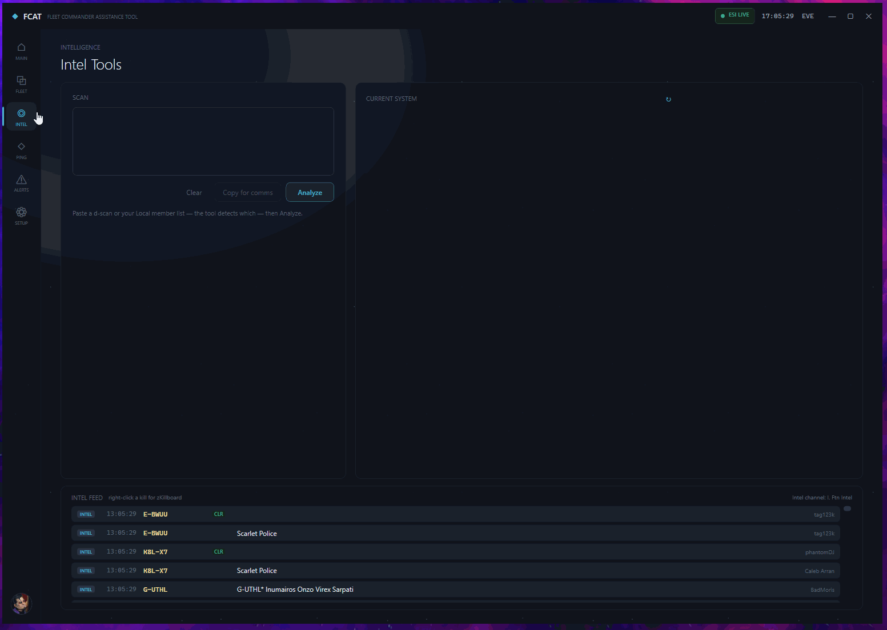
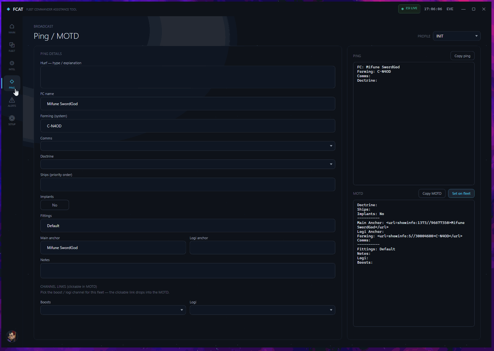
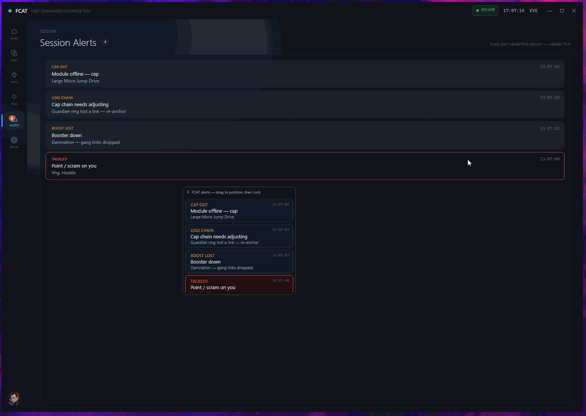

<div align="center">

# FCAT, the Fleet Commander Assistance Tool

**A desktop companion for EVE Online fleet commanders.**

Live fleet readout, ship-role classification, boost tracking, configurable alerts, a constellation map and a d-scan analyzer, built from EVE's ESI API and your local game logs. Everything runs on your machine. Nothing leaves your PC.

</div>

---

## Table of contents
- [What is FCAT](#what-is-fcat)
- [Demos](#demos)
- [Features](#features)
- [What FCAT can and can't see](#what-fcat-can-and-cant-see)
- [Download (beta)](#download-beta)
- [Building from source](#building-from-source)
- [EVE developer app setup](#eve-developer-app-setup)
- [Tech stack](#tech-stack)
- [Security and privacy](#security-and-privacy)
- [Roadmap](#roadmap)
- [Credits](#credits)
- [License](#license)

---

## What is FCAT

FCAT is a Windows desktop tool that sits beside EVE Online and gives the FC a single live picture of their fleet. It logs in with EVE SSO, polls the fleet over ESI every few seconds, and enriches that with data parsed from your local EVE logs (combat log and boost channel).

It does not read or modify game memory, automate any input, or do anything against the EULA. It only uses the official ESI API and the text-log files EVE writes to disk.

---

## Demos

### Command Center


| Intel: system map and live feed | Ping / MOTD builder |
|:-------------------------------:|:-------------------:|
|  |  |

| Alerts and on-screen overlay |
|:----------------------------:|
|  |

---

## Features

### One-click EVE SSO login
Logs in through EVE's official OAuth2 SSO in your browser. No password ever reaches FCAT. Characters you add are remembered between launches, encrypted on your machine.

### Command Center
Your character, corp and alliance, live fleet detection, and three status tiles: fleet readiness, threat in your current system, and your latest alert. Your alts show their own system, ship and fleet status alongside.

### Live fleet view
- Polls the fleet over ESI every 5 seconds.
- Full hierarchy: Fleet Commander, wings, wing commanders, squads, squad leads, members.
- Character portraits and ship icons from the EVE image server.
- Squad leads are highlighted and floated to the top of their squad.

### Ship-role tagging
Every pilot is auto-classified by hull into a coloured role: Logi, FAX, Booster, Tackle, Dictor, EWAR, Support, Cap, Industrial, Mining, DPS, resolved from ESI ship groups. Right-click a pilot to override the role for that hull across the fleet, for T3s whose fit FCAT can't see.

### Composition and boost coverage
A header strip tallies the fleet by role (`4 LOGI · 12 DPS · 2 TACKLE …`) and shows which command-burst categories are up and which are missing (`Shield ×2 · Skirmish ×1 · Armor — · Info —`). A mass tile totals the fleet's hull mass against wormhole limits.

### Fleet-health advisories
Flags problems at a glance: no logistics, low logi, no tackle. Detects the fleet's mainline hull, so a Nighthawk doctrine reads as DPS rather than 70 boosters, and recognises mining fleets so combat advisories stay quiet.

### Member management
Full fleet control from the window (requires fleet boss):
- Kick any pilot, with confirmation.
- Move or promote, to a squad, squad commander, wing commander or fleet commander.
- Invite by name, resolved through ESI.
- Create, delete and rename wings and squads.

### Boost loadout tracking
Reads the fleet's boost channel, where boosters drag their loaded command-burst charges, and attaches each booster's links to their row. Detects when a booster pods out and raises a boost-lost alert.

### Alerts
FCAT raises an alert when something needs the FC's attention:

| Alert | Fires when |
|-------|-----------|
| Tackled | You are scrammed or pointed |
| Intel call-out | Your system, or one next door, is named in the intel channel |
| DPS loss | The fleet's damage line is dying (30 / 50 / 75% of baseline) |
| Logi thin | Logi drop below your chosen ratio of the fleet |
| Cap chain | A cap-chain logi dropped and the ring needs re-forming |
| Booster down | A tracked booster was podded and their links are gone |
| Cap out | A module shut off from insufficient capacitor |

Each alert has a severity (info, warning, critical) driving its colour, its sound, and how long it stays on the overlay. Each has its own sound, from six built-in presets or your own `.wav`, and can be muted individually without disappearing from the feed.

You can also write your own. Point a rule at the intel channel or your game log, give it a word, phrase or regex to watch for, pick how loud it should be, and name it. Test-fire any alert to hear it before a fight.

Alerts show in a feed and on a movable on-screen overlay that floats over the game and can be locked to click-through.

### Intel: map, d-scan and live feed
A minimap of your constellation on the 2D layout players know, centred on you at a fixed scale, with gates, exits, recent kills and a fresh-kill pulse. Click a system to look around it, right-click for Dotlan or zKillboard. It also runs as a second on-screen overlay so you can keep it over the game.

Beside the map, the three things an FC actually reads a map for:
- **In range**: where PvP is happening within *N* jumps, closest and hottest first.
- **Content**: ratting picking up, sov timers counting down, incursions, FW contest.
- **Escapes**: the ways out of the constellation, quietest first, because an exit with a fight on it isn't an escape.

The d-scan analyzer takes a directional scan or your Local member list and gives an instant threat breakdown by role (`3 LOGI · 7 DPS · 2 TACKLE · 1 DICTOR`) plus a per-ship list, with drones, structures and pods filtered out. Copy for comms produces a clean summary for Discord or fleet chat. A live intel feed runs alongside, combining zKillboard kills in your system with reports from your in-game intel channel.

### Ping / MOTD builder
Compose a fleet ping (Hurf, FC, forming, comms, doctrine) and a formatted fleet MOTD from shared dropdowns, then push the MOTD straight to your fleet over ESI. Alliance profiles carry their own doctrines, comms channels and clickable in-game boost and logi channel links. Doctrines link to their fitting page, and the forming system and anchors become clickable in-game links. Alliance profiles are locked to members of that alliance.

### Form-up and straggler tracking
Set your staging system, with autocomplete. While forming, a quiet panel shows who hasn't arrived yet. Once the fleet moves out it auto-hides, then silently logs anyone left behind in staging to the after-action report. Pilots who got podded back are excluded.

### Logi cap-chain advisory
For cap-chain logi (Guardian, Basilisk, Osprey, Augoror) FCAT builds an alphabetical cap-chain order that every fleet derives the same way, and alerts the FC when a chain member drops so the ring can be re-formed. Built from authorized ESI fleet data only. It does not read the in-game chain or automate anything.

### After-action report
A running timeline of the op: alerts, pilots joining and leaving, form-up events, plus a battle report of the fight pulled from zKillboard. Copy it or save it as Markdown for your fleet write-up.

### Demo mode
Runs the whole app against a simulated 24-pilot fleet so you can try the roster, composition, alerts and overlay without a live fleet. Intel stays real.

### Settings
Configure your EVE logs folder, with live checks that Gamelogs and Chatlogs were found, the boost and intel channel names, your form-up system, and the colour theme (Nebula, Carbon, Photon, Rust). Alert configuration lives on the Alerts page, next to the feed.

---

## What FCAT can and can't see

FCAT is deliberately honest about the limits of EVE's data. This matters if you're vetting the code:

| Data | Source | Notes |
|------|--------|-------|
| Fleet hierarchy, ships, systems | ESI | Live, every 5s. You must be the fleet boss. EVE only serves fleet data to the boss, so being FC or a wing commander isn't enough. FCAT tells you when that's why the page is empty. |
| Tackle on you | Combat log | `Warp scramble attempt …`, the only EWar EVE logs |
| Boost loadouts | Boost chat channel | Only what pilots drag into the channel, and the FC must be in that channel. |
| Kills, jumps, ratting near you | ESI | Updates roughly hourly. Good for "where has been busy", not a live feed. |
| Map layout | Bundled | Ships with FCAT, so the map works offline. Layout by [Wollari / dotlan.net](https://evemaps.dotlan.net), credited in-app. |
| Pilots in space, cynos, beacons | none | Doesn't exist in EVE's API. Nothing can show you a live head-count per system. |

---

## Download (beta)

Grab the latest release from the [Releases](../../releases) page:

- **`FCAT-win-Setup.exe`**, the installer. Install once and FCAT updates itself from then on.
- **`FCAT-win-Portable.zip`** if you'd rather not install anything.

The .NET runtime is bundled in, so there's nothing else to install.

> **Requirements:** Windows 10 or 11. For the on-screen overlay to appear over EVE, run the game in borderless or windowed fullscreen. A topmost window can't draw over exclusive fullscreen.

The beta isn't code-signed yet, so Windows SmartScreen will warn about an unknown publisher. Click "More info" then "Run anyway".

---

## Building from source

```bash
# 1. Clone
git clone https://github.com/MifuneSG/FCAT.git
cd FCAT

# 2. Add your EVE app credentials
#    Copy the template and fill in your client id/secret (AppSecrets.cs is gitignored)
copy FCAT\AppSecrets.example.cs FCAT\AppSecrets.cs
#    then edit FCAT/AppSecrets.cs

# 3. Run
dotnet run --project FCAT/FCAT.csproj
```

**Prerequisites:** [.NET 10 SDK](https://dotnet.microsoft.com/download) with the Windows desktop workload.

To cut a distributable installer, see [RELEASING.md](RELEASING.md).

---

## EVE developer app setup

To build from source you need your own EVE application at <https://developers.eveonline.com>:

- **Callback / Redirect URI:** `http://localhost:7648/callback`
- **Scopes** (all six are required, login fails with an "invalid scope" error if any are missing):
  - `esi-fleets.read_fleet.v1`
  - `esi-fleets.write_fleet.v1`
  - `esi-location.read_location.v1`
  - `esi-location.read_online.v1`
  - `esi-location.read_ship_type.v1`
  - `esi-universe.read_structures.v1`

Put the resulting client ID and secret into `FCAT/AppSecrets.cs`.

---

## Tech stack
- C# / .NET 10, WPF (Windows desktop)
- MVVM via [CommunityToolkit.Mvvm](https://github.com/CommunityToolkit/dotnet)
- EVE ESI REST API (OAuth2 SSO, fleet and universe endpoints)
- Local log parsing (Gamelogs combat log, Chatlogs boost and intel channels)
- [Velopack](https://velopack.io) for the installer and in-app updates

---

## Security and privacy
- FCAT only talks to EVE's official ESI API and reads EVE's local log files. It does not read game memory, inject input, or automate gameplay.
- No passwords are stored. Login goes through EVE SSO in your browser. Your refresh tokens are encrypted on your machine with Windows DPAPI.
- The real ESI client secret is baked into the published `FCAT.exe`. This is normal for a distributed client app, but it means the exe is as sensitive as that secret. The secret is never committed to source: `FCAT/AppSecrets.cs` is gitignored, and contributors use `AppSecrets.example.cs`.

---

## Roadmap
Ideas under consideration, not promises:
- Hunt tab, a hunting-ground finder ranking active systems within range
- Route danger readout (kills and jumps per hop)
- Doctrine import and fit-aware classification
- ISK destroyed near you
- More alert types as EVE exposes them
- More alliance profiles

---

## Credits

The map's 2D system layout comes from [Dotlan EveMaps](https://evemaps.dotlan.net) by Wollari, the arrangement EVE players actually recognise, which isn't derivable from CCP's own data. FCAT bundles the coordinates so the map works offline, and credits Dotlan on the map itself.

EVE Online and all related material are trademarks of CCP hf. FCAT is a third-party tool and is not affiliated with or endorsed by CCP.

---

## License

FCAT is released under the [MIT License](LICENSE). Free to use, fork and modify, just keep the copyright notice. It comes with no warranty.

---

<div align="center">
<sub>FCAT is a third-party tool and is not affiliated with or endorsed by CCP Games. EVE Online is a trademark of CCP hf.</sub>
</div>
